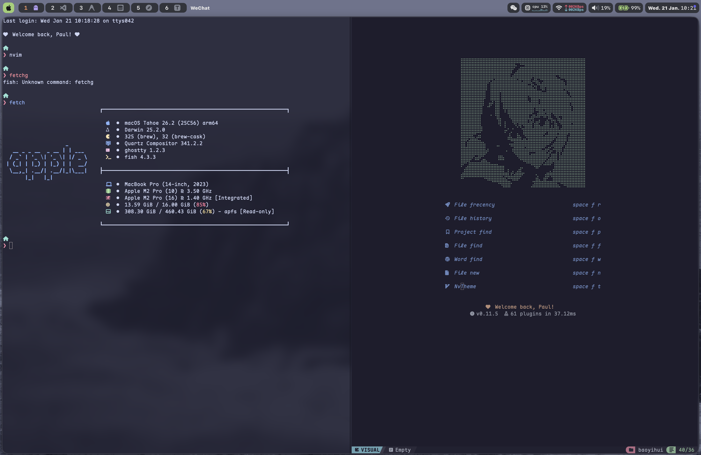

# 个人开发环境配置 (My Dotfiles)

欢迎来到我的个人 macOS 开发环境配置文件仓库。这里存放了我为各种工具所做的定制化配置，整体采用 [Catppuccin](https://github.com/catppuccin/catppuccin) Macchiato 主题风格。

## 桌面预览

## 配置详情

以下是我的主要配置清单：

| 分类 | 工具 | 描述 |
| :--- | :--- | :--- |
| **macOS 桌面** | | |
| 窗口管理器 | [`yabai`](https://github.com/koekeishiya/yabai) | 一款适用于 macOS 的平铺式窗口管理器。 |
| 状态栏 | [`sketchybar`](https://github.com/FelixKratz/SketchyBar) | 高度可定制的 macOS 状态栏。 |
| 快捷键守护进程 | [`skhd`](https://github.com/koekeishiya/skhd) | 与 `yabai` 配套使用的快捷键绑定工具。 |
| **终端与 Shell** | | |
| 终端模拟器 | [`Kitty`](https://sw.kovidgoyal.net/kitty/), [`Ghostty`](https://github.com/ghostty-org/ghostty) | GPU 加速的现代化终端。 |
| Shell | [`Fish`](https://fishshell.com/) | 智能且用户友好的命令行 Shell。 |
| Shell 提示符 | [`Starship`](https://starship.rs/) | 适用于任何 Shell 的极简、极速、可无限定制的提示符。 |
| **开发工具** | | |
| 代码编辑器 | `Neovim`, `VS Code` | 主要使用 Neovim，配置基于 Lua。 |
| **命令行工具** | | |
| 系统信息 | [`fastfetch`](https://github.com/fastfetch-cli/fastfetch) | 类似 Neofetch，但速度更快、可定制性更强的系统信息工具。 |
| 资源监控 | [`btop`](https://github.com/aristocratos/btop) | 带有 TUI 的现代化资源监视器。 |
| 文件管理器 | [`Yazi`](https://github.com/sxyazi/yazi) | 一款使用 Rust 编写的终端文件管理器。 |

---
*该 README 基于仓库结构生成。*